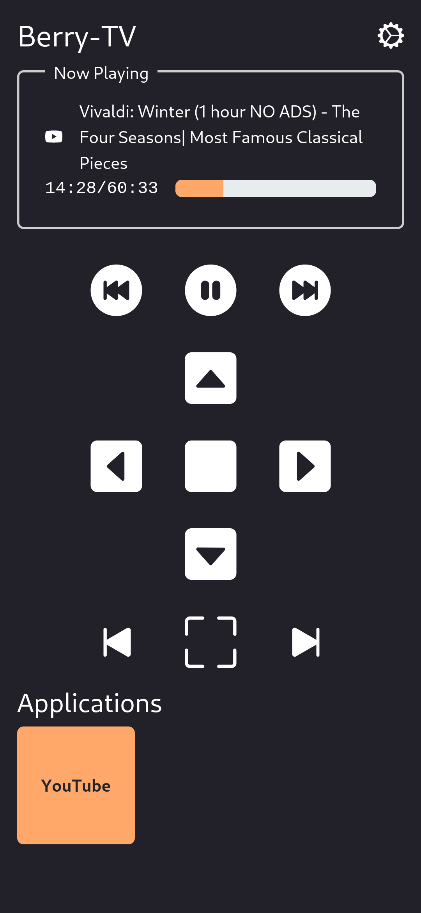

# berry-tv
**berry-tv** is a simple python web server with a web interface that allows you to watch videos from youtube on your tv with uBlock Origin enabled. You can use your phone as a remote control to open videos, pause, play, select related videos, etc.




## Installation
```
git clone https://github.com/kaangiray/berry-tv.git
cd berry-tv
python -m venv env
./server install
./server start
```

## Autostart
If you want to autostart the application on boot, you can copy the `berry-tv.desktop` file to the `~/.config/autostart` directory.